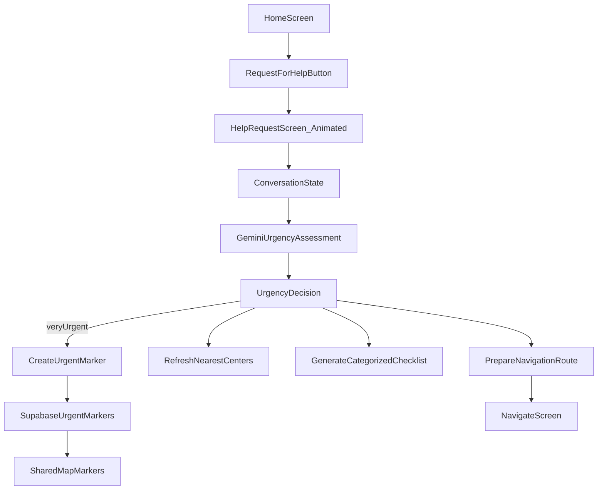

# Request for Help Implementation Plan

## Feasibility Assessment

This is feasible, but **not all parts carry the same risk**:

- **Can do now (high confidence)**
  - Add `Request for Help` button inside home page specifically the HomeFloatingPanel (above the Panahon section) and route to a urgent animated screen.
  - Run Gemini urgency + recommendation assessment from conversation text.
  - Add a user-triggered `Mark as Very Urgent` button action inside the page and persist a shared urgent marker (red) to map.
  - Trigger center refresh + checklist generation + navigation suggestion from assessment result.
- **Can do now with careful scope (medium confidence)**
  - Voice UX via push-to-talk / record-send-playback on the same screen.
- **Higher-risk for immediate release (medium-low confidence)**
  - Full realtime duplex speech-to-speech (continuous streaming both directions) in Expo app; likely needs dedicated audio streaming session management and possibly custom native setup.

Given your choice (`live voice` + `shared marker`), I recommend shipping an MVP in two increments: (1) end-to-end safety flow with robust urgency actions, (2) realtime live voice once infra is stable.

## Current Codebase Anchors

- Home map + marker composition: `[/home/kyae-dev/Repos/devcamp-manila/app/(tabs)/home.tsx](/home/kyae-dev/Repos/devcamp-manila/app/(tabs)`/home.tsx)
- Map reports and offline queue patterns: `[/home/kyae-dev/Repos/devcamp-manila/src/features/map/use-map-reports.ts](/home/kyae-dev/Repos/devcamp-manila/src/features/map/use-map-reports.ts)`
- Centers refresh source: `[/home/kyae-dev/Repos/devcamp-manila/src/features/centers/use-centers.ts](/home/kyae-dev/Repos/devcamp-manila/src/features/centers/use-centers.ts)`
- Existing Gemini service (text request/response): `[/home/kyae-dev/Repos/devcamp-manila/src/services/ai.ts](/home/kyae-dev/Repos/devcamp-manila/src/services/ai.ts)`
- Directions/navigation integration: `[/home/kyae-dev/Repos/devcamp-manila/src/services/maps.ts](/home/kyae-dev/Repos/devcamp-manila/src/services/maps.ts)`
- Preparedness/checklist hook base: `[/home/kyae-dev/Repos/devcamp-manila/src/features/preparedness/use-preparedness.ts](/home/kyae-dev/Repos/devcamp-manila/src/features/preparedness/use-preparedness.ts)`
- DB migrations baseline: `[/home/kyae-dev/Repos/devcamp-manila/supabase/migrations/001_mvp_schema.sql](/home/kyae-dev/Repos/devcamp-manila/supabase/migrations/001_mvp_schema.sql)`

## Target Architecture

## Phase 1 (MVP Safety Flow, ship first)

1. **UI Entry + Animated Screen**

- Add `Request for Help` CTA in `[/home/kyae-dev/Repos/devcamp-manila/app/(tabs)/home.tsx](/home/kyae-dev/Repos/devcamp-manila/app/(tabs)`/home.tsx).
- Create a new route screen (e.g. `app/request-help/index.tsx`) with animated mount/transition and conversation panel.

2. **Conversation + Gemini Assessment (text-first core, voice UI-ready)**

- Extend `[/home/kyae-dev/Repos/devcamp-manila/src/services/ai.ts](/home/kyae-dev/Repos/devcamp-manila/src/services/ai.ts)` with `assessHelpRequest(...)` returning structured JSON:
  - `urgencyLevel` (`low|medium|high|very_urgent`)
  - `recommendedActions[]`
  - `checklistItems[]` with categories
  - `navigationIntent` + destination hints
- Add strict JSON validation + fallback behavior.

3. **Shared Very-Urgent Marker (red) with explicit button in page**

- Add `urgent_rescue_markers` table via new migration under `[/home/kyae-dev/Repos/devcamp-manila/supabase/migrations](/home/kyae-dev/Repos/devcamp-manila/supabase/migrations)`.
- Add Supabase service functions in `[/home/kyae-dev/Repos/devcamp-manila/src/services/supabase.ts](/home/kyae-dev/Repos/devcamp-manila/src/services/supabase.ts)` + type updates.
- Extend map report hook and marker plumbing to render red urgent markers in `[/home/kyae-dev/Repos/devcamp-manila/app/(tabs)/home.tsx](/home/kyae-dev/Repos/devcamp-manila/app/(tabs)`/home.tsx) and map display types.

4. **Background Updates after assessment**

- Centers: add explicit refresh trigger in `[/home/kyae-dev/Repos/devcamp-manila/src/features/centers/use-centers.ts](/home/kyae-dev/Repos/devcamp-manila/src/features/centers/use-centers.ts)` (or wrapper orchestrator hook).
- Checklist: add generated categorized checklist state (new hook/store) and wire to existing preparedness UI model.
- Navigation: prefetch route using `[/home/kyae-dev/Repos/devcamp-manila/src/services/maps.ts](/home/kyae-dev/Repos/devcamp-manila/src/services/maps.ts)` and expose `Start Navigation` CTA.

5. **Safety + resilience**

- Offline queue support for urgent marker creation (reuse queue pattern from `use-map-reports`).
- Rate-limit and dedupe urgent submissions.
- Add explicit user confirmation before marking as very urgent.

## Phase 2 (Live Speech-to-Speech)

1. Implement real audio capture + streaming transport for Gemini live conversation.
2. Add turn management (listen/speak states, interruption handling, retries).
3. Stream partial transcripts into same assessment pipeline for continuous urgency updates.
4. Keep a push-to-talk fallback if live session fails.

## Validation and Test Plan

- Unit test JSON parser + fallback paths for `assessHelpRequest`.
- Integration test: help flow creates urgent marker and marker appears on home map after realtime event.
- Integration test: centers refresh invoked post-assessment.
- Integration test: checklist categories populated from Gemini output.
- Manual test: navigation CTA opens route with expected destination.
- Failure drills: no network, no Gemini key, Supabase unavailable, permissions denied.

## Delivery Recommendation

- **Now**: build and ship Phase 1 end-to-end.
- **Immediately after**: add Phase 2 live voice as an enhancement once audio streaming layer is stable.
